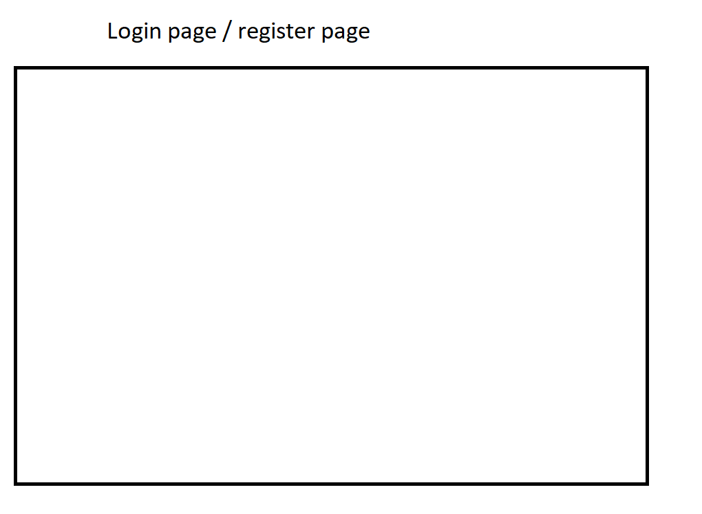
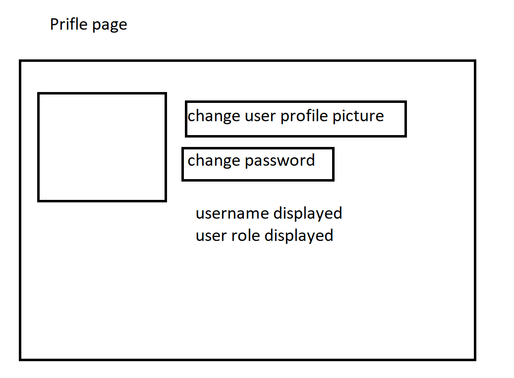
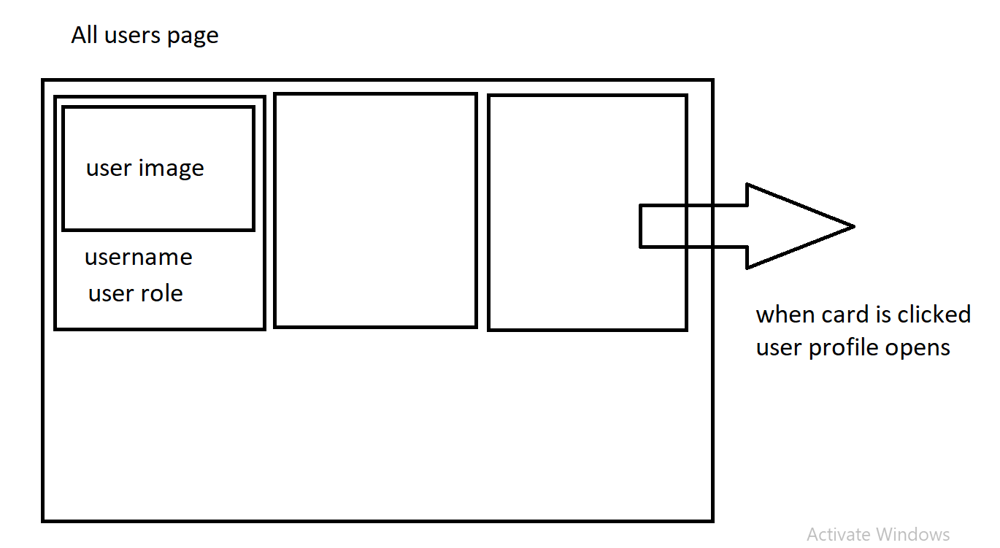
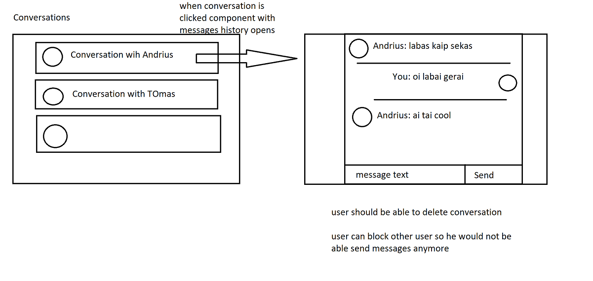

# Asingment

## Functionality

- Create user (admin role and regular role) ☑️
- Login with existing user ☑️
- Update logged user photo ☑️
- Preview All users in app ☑️
- Preview single user profile ☑️
- Send message to other users 🧰
- Preview all conversations 🧰
- Delete conversation 🧰
- Block user (user can't send messages to you anymore) 🧰
- Delete user (if you are admin) ☑️

## Pages

### Register ☑️

Page in which user are registered.
- New user should provide his `username`, `two` passwords, and select his role - `admin` or `regular` ☑️

- Validate these fields:
  - username - min length `4`, max length `20` ☑️
  - password - min `4`, max `20`, upper case letter should be included, special symbol should be included (`!@#$%^&*_+`) ☑️

- two users with same username can't be registered ☑️

> Make sure validation errors is displayed ☑️

 - When user is registered successfully, he is navigated to login page ☑️

### Login ☑️

 - user login with his credentials (username, password) ☑️
 - If user does not exist, message should be displayed ☑️

 - When user logs in he is navigated to Profile page☑️

 - When user logs in Toolbar should show two [_??? maybe THREE ????]_ more links
    - `Profile`☑️
    - `All Users`☑️
    - `Conversations` ☑️

### Profile

- in this page user can change his profile picture ☑️
- in this page user can change his password ☑️
- In this page user can see his role (admin/regular) ☑️
- in this page user can see his username ☑️

### All users

- in this page all users is shown in list ☑️
- each user card should have username, user role, user photo ☑️
- when user card is clicked it should navigate to this particular user profile ☑️

### Particular user profile /user/:username  `for now _/users/:id_`

- in this page user info is shown - username, photo, role ☑️
- in from this page you can send message to user 🧰

- if you are admin in this page "Delete user" button should be displayed ☑️
  - when clicked it deletes user with all his info (user messages should stay) ☑️

### Conversations (link should show how many active conversations you have)

- in this page you can see all conversations you having 🧰
- when someone sends you new message it appears in this page as new conversation
- user should be able to delete conversation
- in this page you can open one of conversations to send message
- in this page when particular conversation is open, you can choose - to block user (when blocked, user can't send messages to you anymore, he gets message "you are blocked by (username who blocked him)")
- When user is blocked each of conversation participants can not send messages anymore

## Prerequisites
`yarn`
# Setup
`yarn`
`yarn rw prisma migrate`
`yarn rw dev`

## .env file example

DATABASE_URL=file:./dev.db
TEST_DATABASE_URL=file:./.redwood/test.db
PRISMA_HIDE_UPDATE_MESSAGE=true
LOG_LEVEL=trace
SESSION_SECRET=zffzjCEfwm9tkfdBrsQGwS4VtfDjrpcghV4tWTmAAY8Pxt5DG3kFSTZfF8oH49Km
